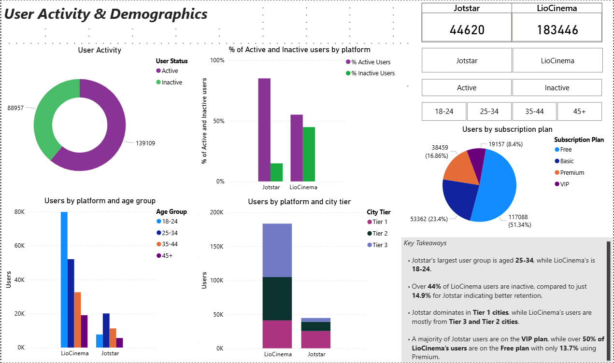

# OTT Merger Data Analysis - LioCinema x Jotstar

This data analysis and visualization project is based on a mock business case by [Codebasics](https://codebasics.io/challenge/codebasics-resume-project-challenge). The goal was to provide strategic insights to support the merger of two OTT platforms, **LioCinema** and **Jotstar**, using real-world analytical techniques.

The project involves SQL-based data exploration and Power BI dashboard creation to analyze content libraries, user behaviour, subscription trends, watch time, and revenue impact.

## Problem Statement

Lio, a leading telecom provider in India, is planning a strategic merger with Jotstar, one of the country’s most prominent streaming platforms. The goal is to combine LioCinema’s subscriber base with Jotstar’s content library to become the dominant OTT player in India.

The management team at Lio wants to analyze platform performance, content consumption patterns, subscriber growth, upgrade/downgrade trends, and inactivity behaviour from **Jan–Nov 2024**.

As the assigned analyst, my task was to uncover business insights and make data-driven recommendations to help position **Lio-Jotstar** as the leading OTT platform post-merger.

You can view the official documents below:
- [Problem Statement](problem_statement.pdf)
- [Business Questions](primary_and_secondary_questions.pdf)

## Data Collection, Preparation & Transformation

All data was provided by [Codebasics](https://codebasics.io/challenge/codebasics-resume-project-challenge) as part of a case study project. Two SQL files, `LioCinema_db.sql` and `Jotstar_db.sql`, were used to create relational databases in MySQL.

### Databases:

- **LioCinema_db**: Contains tables for `subscribers`, `contents`, and `content_consumption`
- **Jotstar_db**: Contains a similar structure with `subscribers`, `contents`, and `content_consumption`

### Key Data Preparation Steps:

- Imported `.sql` files into **MySQL Workbench**

- Created SQL scripts for each business objective instead of combining all data upfront. This approach allowed focused analysis for different questions.
  
#### SQL scripts created
  - [Combined_content.sql](SQL%20scripts/Combined_content.sql): For content type, genre, and language comparisons
  - [Upgrade_trends.sql](SQL%20scripts/Upgrade_trends.sql) & [Downgrade_trends.sql](SQL%20scripts/Downgrade_trends.sql): To analyze plan transitions
  - [monthly_new_subscribers.sql](SQL%20scripts/monthly%20_new_subscribers.sql): To analyze growth trends from Jan–Nov 2024
  - [subscribers with content consumption.sql](SQL%20scripts/subscribers%20with%20content%20consumption.sql): Joined `subscribers` with `content_consumption` to analyze user activity & demographics, watch time & inactivity correlation, and paid users distribution. Created a new column `user_status` (Active vs. Inactive)

- Cleaned and exported specific query outputs as **CSV files** for Power BI visualization

#### Power Query Transformations
  - Converted watch time from minutes to hours (`total_watch_time_hrs`)
  - Appended and joined `Upgrade_trends` and `Downgrade_trends` tables to make `Upgrade and downgrade trends` table
  - Created `PlanPricing` table
  - Added `platform` column to each `LioCinema_db subscribers` and `Jotstar_db subscribers` table, and appended the tables to make the `AllSubscribers` table for revenue analysis. Created seven new columns and two DAX measures:

    a. Time spent on the original plan
       ```
       old plan = DATEDIFF('AllSubscribers'[subscription_date],'AllSubscribers'[plan_change_date], MONTH)
       ```
    b. Time spent on the new plan
       ```
       new plan = DATEDIFF('AllSubscribers'[plan_change_date], COALESCE('AllSubscribers'[last_active_date], TODAY()), MONTH)
       ```
    c. Look up price for the original plan
       ```
       old plan price = LOOKUPVALUE(PlanPricing[price], PlanPricing[subscription_plan], AllSubscribers[subscription_plan], PlanPricing[platform], AllSubscribers[platform])
       ```
    d. Look up price for the new plan
       ```
       new plan price = LOOKUPVALUE(PlanPricing[price], PlanPricing[subscription_plan], AllSubscribers[new_subscription_plan], PlanPricing[platform], AllSubscribers[platform])
       ```
    e. Original plan revenue
       ```
       old plan revenue = 'AllSubscribers'[old plan price] * 'AllSubscribers'[old plan]
       ```
    f. New plan revenue
       ```
       new plan revenue = AllSubscribers[new plan price] * AllSubscribers[new plan]
       ```
    g. Revenue per user
       ```
       revenue per user = AllSubscribers[old plan] * AllSubscribers[old plan price] + AllSubscribers[new plan] * AllSubscribers[new plan price]
       ```
    Total Revenue (Measure)
       ```
       Total Subscribers Revenue = SUM('AllSubscribers'[revenue per user])
       ```
    Average revenue per user (Measure)
      ```
      Avg Revenue Per User = DIVIDE(SUM('AllSubscribers'[revenue per user]), DISTINCTCOUNT('AllSubscribers'[user_id]), 0)
      ```
  - Made three DAX measures for the `monthly_new_subscribers` table:
      - Monthly growth rate %
        ```
        monthly growth rate % = 
        VAR currentmonth = MAX('monthly _new_subscribers'[month])
        VAR platform = SELECTEDVALUE('monthly _new_subscribers'[platform])
        VAR currentusers = SUM('monthly _new_subscribers'[new_users])
        VAR previoususers = CALCULATE(SUM('monthly _new_subscribers'[new_users]), 'monthly _new_subscribers'[month] = EDATE(currentmonth, -1), 'monthly _new_subscribers'[platform] = platform)
        RETURN DIVIDE(currentusers - previoususers, previoususers, 0)
        ```
      - Average growth rate %
        ```
        average growth rate % = AVERAGEX(VALUES('monthly _new_subscribers'[month]),'monthly _new_subscribers'[monthly growth rate %])
        ```
      - Cumulative users
        ```
        cumulative users = CALCULATE(SUM('monthly _new_subscribers'[new_users]), FILTER(ALLSELECTED('monthly _new_subscribers'), 'monthly _new_subscribers'[month] <= MAX('monthly _new_subscribers'[month]) && 'monthly _new_subscribers'[platform] = MAX('monthly _new_subscribers'[platform])))
        ```
        
  - Other DAX measures used for the analyses:
    - % Active users
      ```
      % Active Users = 
      VAR TotalUsers = CALCULATE(DISTINCTCOUNT('subscribers with content consumption'[user_id]))
      VAR ActiveUsers = CALCULATE(DISTINCTCOUNT('subscribers with content consumption'[user_id]), 'subscribers with content consumption'[user_status] = "Active")
      RETURN DIVIDE(ActiveUsers, TotalUsers, 0)
      ```
    - % Inactive users
      ```
      % Inactive Users = 
      VAR TotalUsers = CALCULATE(DISTINCTCOUNT('subscribers with content consumption'[user_id]))
      VAR InactiveUsers = CALCULATE(DISTINCTCOUNT('subscribers with content consumption'[user_id]), 'subscribers with content consumption'[user_status] = "Inactive")
      RETURN DIVIDE(InactiveUsers, TotalUsers, 0)
      ```
    - Average watch time (hours) per user
      ```
      average watch time (hrs) per user = DIVIDE(SUM('subscribers with content consumption'[total_watch_time_hrs]), DISTINCTCOUNT('subscribers with content consumption'[user_id]),0)
      ```
    - Upgrade rate %
      ```
      Upgrade rate % = DIVIDE(SUM('Upgrade and downgrade trends'[upgraded_users]),DISTINCTCOUNT('subscribers with content consumption'[user_id]),0)*100
      ```
    - Downgrade rate %
      ```
      Downgrade rate % = DIVIDE(SUM('Upgrade and downgrade trends'[downgraded_users]),DISTINCTCOUNT('subscribers with content consumption'[user_id]),0)*100
      ```
    - Paid users %
      ```
      Paid Users % = 
      VAR TotalUsers = DISTINCTCOUNT('subscribers with content consumption'[user_id])
      VAR PaidUsers = 
      CALCULATE(DISTINCTCOUNT('subscribers with content consumption'[user_id]), 'subscribers with content consumption'[subscription_plan] IN {"VIP", "Premium", "Basic"})
      RETURN DIVIDE(PaidUsers, TotalUsers, 0)
      ```
    - Total paid users
      ```
      Total Paid Users = 
      CALCULATE(DISTINCTCOUNT('subscribers with content consumption'[user_id]), 'subscribers with content consumption'[subscription_plan] IN {"VIP", "Premium", "Basic"})
      ```

## Data Analysis and Visualization

Business questions were grouped into thematic areas, each addressed on a dedicated Power BI page. Key takeaways are embedded within the dashboards.

#### 1. **Content Library Analysis**


- Total titles: Jotstar **2360** vs. LioCinema **1250**
- Jotstar has a larger content library and a stronger English/regional language mix, while LioCinema leans heavily on Hindi.

#### 2. **User Activity & Demographics**



- Active users: Jotstar **85%** vs. LioCinema **55%**. Higher activity on Jotstar suggests stronger engagement and retention.
- Majority of Jotstar active users **(43.5%)** are on the VIP plan, while LioCinema users, both active and inactive, mostly remain on the Free plan.

#### 3. **Watch Time Analysis & Inactivity Correlation**


- Average watch time (hours): Jostar **352** vs. LioCInema **60**
- LioCinema shows a strong inverse link between engagement and retention; less engaged users (18–24) have the highest inactivity (49%).
- Jotstar users maintain high watch time (310–380 hrs) and consistent retention (~14%) across all age groups, indicating pricing or seasonal usage may influence user drop-off.

#### 4. **Upgrade and Downgrade Trends**


- Upgrade/Downgrade Rate: Jotstar – 1.9% / 1.2%, LioCinema – 1.8% / 9.1%
- Jotstar’s top upgrade: VIP → Premium
- LioCinema’s top upgrade: Free → Basic, but faces major downgrades from Premium/Basic → Free

#### 5. Paid Users Distribution


- Paid user share: Jotstar - 72.9%, LioCinema - 42.8%
- Jotstar splits across VIP (58.8%) and Premium (41.1%)
- LioCinema paid users: mostly on Basic (68%), followed by Premium (32%)

#### 6. Revenue Analysis


- ARPU: Jotstar - **₹388** | LioCinema - lower, due to high downgrade volume
- Jotstar’s strong upgrade behaviour drives revenue, while LioCinema struggles with premium retention.

#### 7. Monthly User Growth Rate


- Average Growth Rate (Jan–Nov 2024): LioCinema - **16.95%** | Jotstar - **0.73%**.
- LioCinema’s affordable plans and regional focus likely fueled faster user acquisition.

## Strategic Recommendations


    
